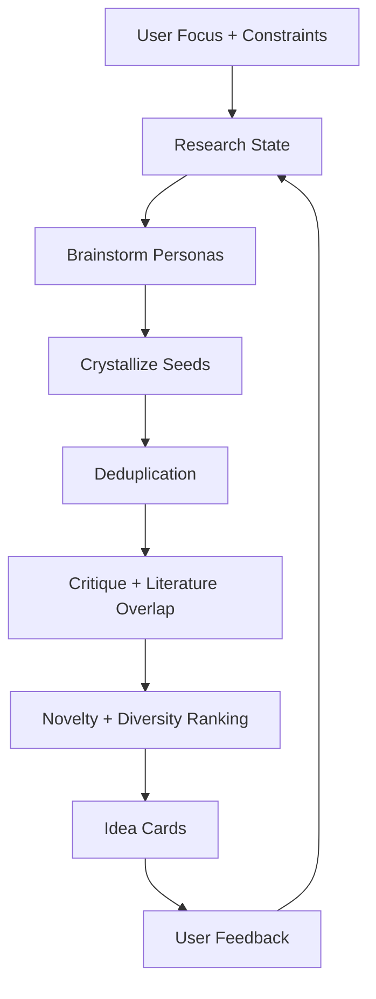

# Architecture

## Project goal

Research Space Explorer treats idea generation as a stateful exploration problem with a separate creative front-end:

1. brainstorm from orthogonal persona viewpoints
2. crystallize loose seeds into structured idea cards
3. track what the user has already explored
4. score, critique, and filter candidates before showing them

## Core data model

### Idea card

An idea card is the unit of ranking. Each card contains:

- `object`
- `puzzle`
- `claim`
- `contrast`
- `evidence`
- `scope`
- `stakes`
- `rationale`
- `origin`
- `critique`
- `scores`

### Brainstorm seed

A brainstorm seed is the unit of creative divergence before structure is imposed. Each seed contains:

- `persona`
- `hook`
- `pivot`
- `questionStem`
- `noveltyAngle`
- `suggestedPuzzles`
- `suggestedClaims`

### Research state

The research state is the working memory for a session. It stores:

- focus and constraints
- visited signatures
- accepted and rejected ideas
- literature nodes already consulted
- current frontier

### Memory graph

The memory graph is the persistent cross-run memory layer. It stores:

- query nodes
- persona nodes
- idea nodes
- paper nodes
- edges such as `generated`, `retrieved`, `proposed`, `nearest_literature`, and `similar_to`

### Literature node

The first retrieval layer uses paper metadata only:

- title
- abstract
- authors
- year
- venue
- keywords

This is enough to estimate obvious overlap before implementing full-text retrieval.

## Engine loop

## Why graph structure matters

The system should eventually store two graphs:

- `idea graph`
  Tracks relations between explored ideas such as refinement, mutation, contrast, or near-duplication.
- `literature graph`
  Tracks similarity and citation neighborhoods between papers.

This MVP implements the graph logic implicitly with signatures and overlap scoring, so the repository can evolve into an explicit graph-backed system later.

## Module responsibilities

### `src/schema.js`

Constructors and normalization helpers for ideas and research state.

### `src/engine/brainstorm.js`

Produces loose seeds from orthogonal creative personas.

### `src/engine/crystallize.js`

Turns loose seeds into structured idea cards.

### `src/engine/critic.js`

Flags shallow combinations, weak contrasts, and crowded literature neighborhoods.

### `src/engine/pipeline.js`

Runs brainstorm, crystallization, critique, ranking, and frontier selection end to end.

### `src/engine/dedupe.js`

Removes exact and near duplicates before ranking.

### `src/engine/scoring.js`

Assigns novelty, diversity, feasibility, creativity, critique penalties, and user-fit scores.

### `src/retrieval/literature.js`

Normalizes literature metadata and supports lexical, embedding, and hybrid retrieval.

### `src/retrieval/vector.js`

Provides the built-in lightweight local embedder and the compatibility layer for future dense embeddings.

### `src/retrieval/graph.js`

Builds and queries a literature similarity graph for neighborhood expansion.

### `src/memory/graph.js`

Persists query, idea, persona, and paper relations across runs.

### `src/memory/store.js`

Loads and saves the memory graph on disk.

## Implementation strategy

### MVP

- deterministic persona-based brainstorming
- token-based overlap scoring
- title and abstract level grounding
- built-in demo and tests

### V2

- external literature retrieval
- dense embedding similarity
- persistence
- explicit idea graph
- citation graph augmentation
- richer library connectors such as CSL-JSON and BibTeX

### V3

- full-text RAG
- planner for next-best unexplored frontier
- user preference learning

## Orthogonal persona set

The first creative layer uses six distinct personas:

- `Anomaly Hunter`
- `Assumption Breaker`
- `Measurement Skeptic`
- `Failure Miner`
- `Boundary Mapper`
- `Analogy Transfer`

These personas are intentionally orthogonal. They are not six tones of "be more creative"; they are six different ways of attacking a research problem.
